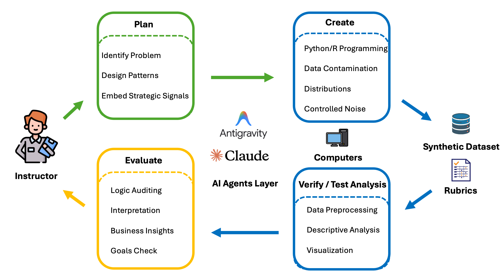
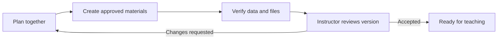

# DataCanvas EDU

*An AI Agent Skill for Synthetic Data Generation in Analytics Education*

**Turn teaching goals into datasets with instructor-defined patterns, verified reference analyses, and assessment materials.**



DataCanvas EDU helps instructors create synthetic business datasets around the discoveries students should practice making. Describe your teaching goals; the Agent helps define the scenario and patterns, writes generation code, checks the resulting data, and prepares teaching materials for your review.

**Instructor control:** The Agent asks which hidden patterns you want students to discover, proposes options, and waits for your feedback. Before generating, it presents one assignment, its discovery-based rubric, and a preview of the output files with recommended formats. You choose or accept those formats. The first package is for review: your feedback can start another planning and revision cycle. The default remains one assignment.

## Try the Skill

1. Follow the [installation guide](docs/INSTALLATION.md) for your Agent tool.
2. Start a fresh conversation and describe a teaching goal. You do not need to write code or complete a technical specification yourself.
3. Choose or revise the proposed hidden patterns, then approve the concrete assignment, rubric, and output formats. The Agent must wait for those decisions before generation.
4. Inspect the first teaching package. The Agent will invite feedback with concrete examples of what can change.
5. Request revisions in plain language, or accept the package. The Agent carries forward settled decisions and returns to planning for the affected parts; you do not need to repeat the initial interview.

### A simple example conversation

Start with **"Help me create a teaching dataset."** The AI guides you through the choices:

> **AI:** What business domain should the case cover? Retail, healthcare operations, HR, or SaaS?
>
> **Instructor:** Healthcare operations.
>
> **AI:** Who are the students, and what is their analytics level?
>
> **Instructor:** Introductory undergraduate analytics students.
>
> **AI:** What tools will they use? Excel, Python, R, or Tableau / Power BI?
>
> **Instructor:** Python with pandas.
>
> **AI:** How large should the assignment be? A short lab, weekly homework, or a multi-week project?
>
> **Instructor:** A single-class lab, about 2–3 hours.
>
> **AI:** Let's use a fictional network of four outpatient clinics, with one quarter of data and one row per scheduled appointment. Here are four patterns students could discover:
>
> - **A — Booking ahead:** Appointments booked further in advance have more no-shows.
> - **B — Reminders:** Reminders are associated with fewer no-shows mainly for appointments booked far ahead.
> - **C — Clinic comparisons:** A clinic looks slower overall but faster within appointment types because it handles a different mix of appointments.
> - **D — A misleading clue:** Insurance appears related to no-shows, but the difference disappears when booking lead time is considered.
>
> **AI:** I suggest grading A, B, and C, with D as an ungraded check against misleading conclusions. Which would you like to include?
>
> **Instructor:** All four.
>
> **AI:** How subtle should the hardest pattern be: clear once students compare groups, moderate, or challenging?
>
> **Instructor:** Moderate.

The AI then proposes the assignment, rubric, and file formats for your approval. After creating and checking the package, it helps you review the results and revise anything you want to change.

Use [this feedback guide](docs/TRY_AND_REPORT.md) to record your trial. For Claude's Skill upload interface, the current download is [datacanvas-edu-v0.1.3.zip](dist/datacanvas-edu-v0.1.3.zip). It contains the Skill folder; the repository's examples and documentation remain separate. Earlier ZIPs remain available for comparison.

**Importing a GitHub plugin marketplace:** Add `https://github.com/BANG23333/datacanvas-edu` in your Codex/ChatGPT desktop plugin interface, then install **DataCanvas EDU** from that marketplace. This repository includes the marketplace manifest and a self-contained plugin. See the [GitHub import instructions](docs/INSTALLATION.md#github-marketplace-import-codexchatgpt-desktop) for the interface that reported a missing manifest.

## How it works

| Phase | Agent work | Instructor decision |
| --- | --- | --- |
| Plan | Ask about hidden patterns, propose one assignment and its rubric, and preview outputs and recommended formats | Approve the teaching design and choose delivery formats |
| Create | Write and execute generation code, retaining parameters and random seeds | Resolve substantive design tradeoffs |
| Verify / Test Analysis | Measure the exported data, check constraints and intended patterns, and prepare reference evidence | Review failures, interpretations, and proposed revisions |
| Evaluate | Present the package in the chosen formats, summarize checks, and invite feedback | Accept the version or return to Plan to revise the agreed parts |



Before work starts, the Agent explains four outputs: **data, assignment, instructor solution, and rubric**. For a Python course, a useful starting recommendation is CSV data and editable Word documents. Excel workbooks, PDFs, and other suitable formats can be discussed. These are choices to confirm, and exports depend on the host's available tools. The format of the assignment document is separate from the format students must submit.

After delivery, feedback can be as simple as "make this pattern subtler," "add a seasonal pattern," or "shorten the assignment and simplify the rubric." The Agent proposes any unresolved changes, preserves previous versions, revises the agreed parts, and brings the result back for review. Document-only changes preserve the approved data. Technical generation retries are separate from this instructor-directed loop.

The resulting package includes:

- **Student materials:** dataset, data dictionary, business context, and assignment.
- **Instructor materials:** a pattern-by-pattern solution with measured evidence, charts and interpretations; major/minor discovery credit, duplicate and invalid-finding examples, a matching rubric, and a review record.
- **Reproducibility materials:** generation and verification code, seeds, parameters, environment information, and file fingerprints.

A numerical pass means the declared checks passed. Final educational suitability remains an instructor judgment.

## Examples across business domains

| Example | Teaching context | Rows | Pattern categories |
| --- | --- | --- | --- |
| [Marketing campaigns](examples/marketing-campaigns/teaching_brief.md) | Conversion and contact cost | 5,000 | 2 |
| [Hotel bookings](examples/hotel-bookings/teaching_brief.md) | Cancellations and quoted room rates | 4,000 | 3 |
| [Equipment rental](examples/equipment-rental/teaching_brief.md) | Turnaround time and repair risk | 3,000 | 2 |
| [WindowDash](examples/windowdash/teaching_brief.md) | Food-delivery operations and customer behavior | 15,000 | 8 |

These are editable development cases, not the limits of the Skill. The Agent can write new case code and custom measurements. WindowDash is one example; its variables, chart requirements, and grading scale are not global defaults. Its inherited rubric still requires instructor reconciliation.

## Repository contents

```text
skills/datacanvas-edu/   Installable Skill: SKILL.md, scripts, and references
.agents/plugins/        Manifest for importing this GitHub repository as a marketplace
plugins/datacanvas-edu/  Plugin manifest and generated copy of the complete Skill
examples/              Four case configurations and teaching briefs
docs/                  Installation, trial guidance, and evidence boundaries
tests/                 Behavioral checks for the shared helper
scripts/               Rebuild the Skill archive and synchronize the plugin bundle
dist/                  Versioned Skill ZIP and its file manifest
```

## Run a reproducible example

The natural-language Skill is the instructor interface. The commands below are optional developer/researcher checks that run supplied example specifications directly. They do not perform the instructor interview or establish approval. In a teaching conversation, the Agent must obtain design approval before running a build. Run from the repository root with Python 3.10 or newer:

```sh
python3 -m venv .venv
source .venv/bin/activate
python -m pip install -r requirements.txt
python skills/datacanvas-edu/scripts/dataset_workflow.py build --case examples/hotel-bookings --output outputs/hotel-trial-01 --seed 101
python skills/datacanvas-edu/scripts/dataset_workflow.py verify-package --package outputs/hotel-trial-01
```

On Windows, activate the environment with `.venv\Scripts\Activate.ps1`. Use a new output directory for each build. Plotting uses Matplotlib; the WindowDash generator also uses NumPy and pandas. The common numerical helper itself uses the Python standard library. Python package installation is handled by the host environment; installing a Skill does not automatically configure every dependency.

Run the behavioral checks or rebuild the archive:

```sh
python -m unittest discover -s tests -v
python scripts/package_skill.py
python scripts/package_plugin.py
python scripts/package_plugin.py --check
```

Edit the canonical Skill under `skills/datacanvas-edu/`, then rebuild both distribution formats. The bundled copy under `plugins/` is generated; the check above catches missing files and stale copies.

## Evidence and development plan

The original implementation was checked across four configurations, with 16 runs and 64 required numerical check evaluations. All met their configured criteria. Same-seed repeats reproduced dataset bytes, and 18 behavioral tests passed. These are scoped engineering results, not a teacher usability study or evidence of student learning. See [validation and research status](docs/VALIDATION.md).

The first instructor trial and the v0.1.2 response are documented in [trial feedback](docs/TRIAL_FEEDBACK_V0.1.2.md). The v0.1.3 follow-up makes output choices and repeated review more explicit; see the [changelog](CHANGELOG.md). Next steps are a fresh-conversation trial through format selection, first delivery, an instructor-requested revision, and final acceptance, followed by platform checks and a formal versioned release. The intended preprint will document the framework and measured artifact evidence. Analysis-Agent comparisons and student learning studies remain separate research stages.

## Contributing and release status

See [CONTRIBUTING.md](CONTRIBUTING.md) for useful feedback and example contributions, and [CHANGELOG.md](CHANGELOG.md) for version history. All repository artifacts and code use English; instructor conversations may use the instructor's preferred language.

The repository became public on 2026-09-08. A license and formal citation will be added when those decisions are finalized. The source, v0.1.3 Skill ZIP, prior ZIPs, and repository-hosted plugin marketplace are available here. This does not imply a paper, formal GitHub Release, or listing in an official curated plugin catalog.
