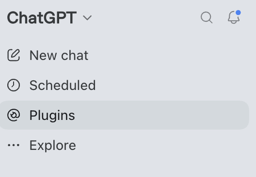
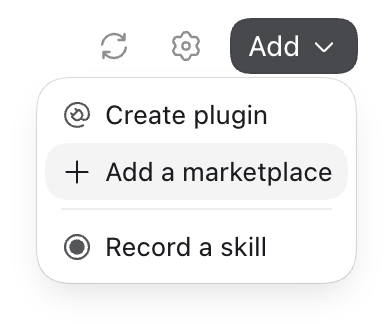
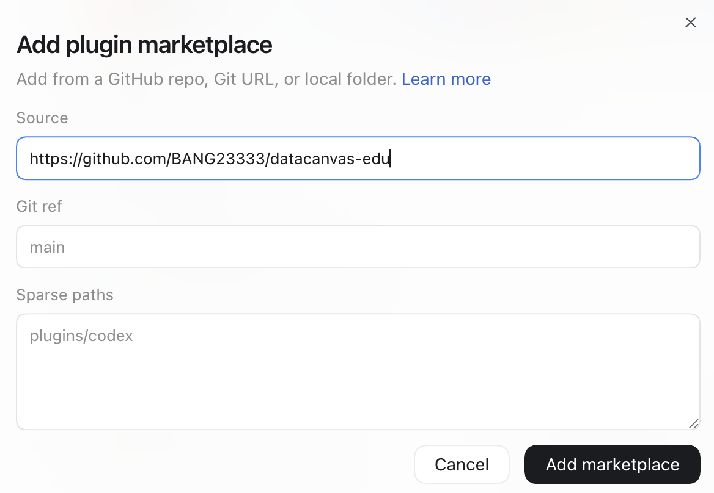

# Install DataCanvas EDU

Add DataCanvas EDU to your AI tool, then start a conversation about your class. Current Skill version: **0.1.3**.

[ChatGPT](#chatgpt) · [Claude app](#claude-app) · [Codex](#codex) · [Claude Code](#claude-code)

<a id="runtime-and-updates"></a>

## Before you start: Python

**Your AI tool needs access to a working Python 3.10+ environment, with permission to run code and create files.** Installing the Skill does not install Python.

- **If your tool provides Python:** enable its code execution and file creation features and use that environment.
- **If your tool runs locally and does not provide Python:** install Python 3.10 or newer and make sure the agent can use it. The optional setup commands below create a project environment.
- **For charts and the bundled examples:** make Matplotlib, NumPy, and pandas available in the same environment. The package versions are listed in [requirements.txt](../requirements.txt); the core numerical helper uses Python's standard library.

You can ask your AI to check the setup:

> Check that you can run Python 3.10 or newer, import matplotlib, numpy, and pandas, and create files in this project. If anything is missing, help me set up the Python environment before we use DataCanvas EDU.

<details>
<summary>Optional: set up Python on your computer</summary>

Install Python from [python.org](https://www.python.org/downloads/). If you have downloaded or cloned this repository, open a terminal in its folder and run:

**macOS / Linux**

```sh
python3 -m venv .venv
source .venv/bin/activate
python -m pip install -r requirements.txt
```

**Windows (PowerShell)**

```powershell
py -3 -m venv .venv
.\.venv\Scripts\python.exe -m pip install -r requirements.txt
```

Ask your agent to use this project's `.venv` environment. Its Python executable is `.venv/bin/python` on macOS/Linux or `.venv\Scripts\python.exe` on Windows.

</details>

<a id="github-marketplace-import-codexchatgpt-desktop"></a>

## ChatGPT

In the ChatGPT desktop interface shown below, install DataCanvas EDU from its GitHub marketplace. You only need to add it once.

### 1. Open Plugins

Select **Plugins** in the left sidebar.



### 2. Add a marketplace

Click **Add**, then **Add a marketplace**.



### 3. Enter the repository URL

Paste this into **Source**:

```text
https://github.com/BANG23333/datacanvas-edu
```

Set **Git ref** to `main`, leave **Sparse paths** empty, and click **Add marketplace**.



### 4. Install DataCanvas EDU

Open **DataCanvas EDU** in the added marketplace and use its install button (**+**). Adding the marketplace and installing its plugin are two separate steps.

### 5. Start a new chat

Select the installed DataCanvas EDU plugin and send:

> Use DataCanvas EDU to help me create a teaching dataset.

The AI will ask about your class and guide you through the scenario, hidden patterns, assignment, rubric, and output formats. You approve the plan before it generates the teaching package.

If your ChatGPT interface offers **Skills > Create > Upload from your computer** instead, upload the [Skill ZIP](../dist/datacanvas-edu-v0.1.3.zip), enable it, and start a new chat.

## Claude app

1. Download [datacanvas-edu-v0.1.3.zip](../dist/datacanvas-edu-v0.1.3.zip). On its GitHub file page, click the download button.
2. Enable **code execution and file creation** in Claude.
3. Open **Customize > Skills**, choose the option to create a Skill, then **Upload a skill**.
4. Upload the ZIP and enable DataCanvas EDU.
5. Start a new conversation and ask: **"Use DataCanvas EDU to help me create a teaching dataset."**

Use the linked Skill ZIP for this upload; it contains the Skill and its supporting files.

<a id="codex-local-tools"></a>

## Codex

**Desktop:** follow the [ChatGPT marketplace steps](#chatgpt) in the Plugins interface.

**CLI:** add the marketplace and install its plugin:

```sh
codex plugin marketplace add https://github.com/BANG23333/datacanvas-edu
codex plugin add datacanvas-edu@datacanvas-edu
```

Start a new conversation, select the Skill or include `$datacanvas-edu` in your prompt, and describe your class. Make sure Codex can use your [Python environment](#before-you-start-python).

<details>
<summary>Alternative: install the Skill folder manually</summary>

Copy the complete [skills/datacanvas-edu](../skills/datacanvas-edu/) folder to either:

- `~/.agents/skills/datacanvas-edu/` for your personal installation.
- `.agents/skills/datacanvas-edu/` inside a project for use in that project.

Keep `SKILL.md`, scripts, and references together. Restart Codex if the Skill does not appear.

</details>

## Claude Code

1. Download or clone this repository.
2. Copy the complete [skills/datacanvas-edu](../skills/datacanvas-edu/) folder to `~/.claude/skills/datacanvas-edu/` for personal use, or `.claude/skills/datacanvas-edu/` inside your project.
3. Open Claude Code in your project and allow it to run Python and create files.
4. Enter `/datacanvas-edu` and describe your teaching goal.

<a id="updating-an-earlier-marketplace-installation"></a>

## Updating the Skill

- **Marketplace installation:** refresh the marketplace, update DataCanvas EDU, and start a new conversation.
- **ZIP or folder installation:** replace the installed copy with the latest Skill package, then start a new conversation.

<details>
<summary>Codex CLI update commands</summary>

```sh
codex plugin marketplace upgrade datacanvas-edu
codex plugin add datacanvas-edu@datacanvas-edu
```

</details>

## Official guides

[ChatGPT plugins](https://learn.chatgpt.com/docs/plugins) · [OpenAI skills](https://learn.chatgpt.com/docs/build-skills) · [Claude skills](https://support.claude.com/en/articles/12512180-use-skills-in-claude) · [Claude Code skills](https://code.claude.com/docs/en/skills)
